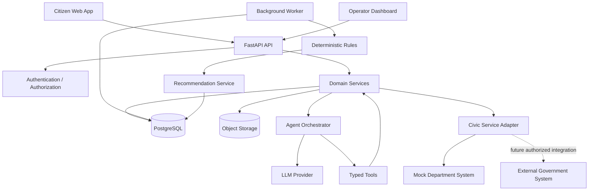

# Awwaz — Full Implementation-Ready Product Requirements Document

Version: Hackathon MVP v1.0
Date: September 12, 2026
Status: Build-ready specification for a solo hackathon implementation
Product: Awwaz
Domain: Awwaz.ai
Category: Agentic Civic Operations
Hackathon context: AI Tinkerers — “Agents, Everywhere: Bots, Channels, & More”

Core thesis:
Awwaz is not another citizen complaint portal. Pakistan already has an official Pakistan Citizen's Portal. The product opportunity is the operational layer around a complaint after submission: understanding, structuring, routing, responsibility tracking, commitment tracking, progress monitoring, stalled-case detection, follow-up preparation, escalation recommendation, human approval, action confirmation, and memory.

Verified external context used in this PRD:
The official Pakistan Citizen's Portal site describes PCP as a Government-owned mobile application and nationwide window connecting citizens with government organizations for raising issues, complaint redressal and suggestions. It also describes PMDU's grievance-redressal/accountability role. No undocumented PCP API, integration permission, SLA, escalation authority, or internal operational procedure is assumed here.

Hackathon implementation boundary:
The MVP uses a replaceable civic-service adapter backed by a simulated department system. This lets the project demonstrate real agent behavior without depending on an external government integration that has not been verified.

North-star statement:
“Existing systems collect complaints. Awwaz works on what happens next.”

Demo statement:
“Awwaz does not stop when the complaint is submitted.”


# 1. Executive Summary

Product name: Awwaz.

One-line description:
Awwaz is an AI civic agent that turns natural-language complaints into persistent, auditable workflows and keeps working on the next required action.

Elevator pitch:
Citizens can already submit complaints through official and local channels. The harder operational problem is what happens after submission: someone must interpret the issue, route it, track responsibility, follow up on promises, detect delays, and escalate cases that are not progressing. Awwaz provides an agentic coordination layer for that work. A citizen can describe a problem in English, Urdu, or Roman Urdu; Awwaz converts the message into a structured case, asks only for missing critical information, routes it, tracks its state, identifies stalled work, recommends the next action, and keeps consequential actions behind human approval.

Primary users:
- Citizens
- Complaint operators
- Department coordinators
- Administrators

Core value:
Reduce repetitive coordination work while improving visibility and continuity around civic cases.

Unique proposition:
Awwaz is intentionally not positioned as a replacement for existing complaint portals. It is an intelligent operational layer that can sit around them when an authorized integration exists.

What makes it agentic:
- It retains state after the initial conversation.
- It retrieves previous relevant cases.
- It decides which permitted tool to use next.
- It reacts to system events.
- It detects when promised work does not occur.
- It generates recommendations.
- It asks humans before consequential actions.
- It records actions and outcomes.

Wow factor:
A judge submits a Roman Urdu complaint. Awwaz identifies the issue, requests the missing location, creates a case, routes it, shows a real tool trace, then a seeded case is made stale. A background worker detects the stall, Awwaz generates a recommendation, an operator approves escalation, the civic adapter confirms an action, and the entire sequence appears in the audit timeline. A second complaint then demonstrates memory and recurrence.

Hackathon relevance:
The supplied event FAQ says AI Tinkerers focuses on active builders, working implementations, technical workflows, tool use, architecture, and technical demos. The Awwaz demo is therefore optimized around visible implementation rather than a slide-heavy product pitch.


# 2. Problem Definition

Awwaz targets the gap between complaint intake and meaningful progress.

The problem is not defined as “government is bad,” because that is too broad and cannot be substantiated as a universal statement. The product problem is narrower and testable: complaints can require repeated interpretation, forwarding, ownership assignment, monitoring, follow-up, escalation, and communication after initial submission.

The current conceptual workflow is:
1. Citizen notices a local issue.
2. Citizen finds a reporting channel.
3. Citizen describes the issue.
4. Information is recorded.
5. The issue must be understood and classified.
6. The right organization or person must receive it.
7. Someone must act.
8. Progress must be recorded.
9. Commitments may be made.
10. Commitments must be checked.
11. Stalled cases may require follow-up.
12. Persistent failures may require escalation.
13. The citizen needs a meaningful update.

Awwaz concentrates on steps 5–13 while still providing an AI-first intake layer for the prototype.

Important positioning constraint:
Do not claim that PCP lacks a particular feature unless verified. Do not claim that ministers, deputy commissioners, or specific officials are always involved in every complaint. Instead, represent the manual escalation/coordination pattern as a plausible operational workflow that the product can automate once the responsible organization and escalation rules are configured.


# 3. Product Vision and Scope

Long-term vision:
Awwaz becomes an AI coordination layer that can operate across authorized complaint channels, municipal systems, departmental queues, messaging channels, and citizen-facing interfaces.

Hackathon MVP vision:
Prove one complete, observable loop:
Understand → Structure → Route → Track → Detect → Recommend → Approve → Act → Verify → Remember.

Product principles:
1. State is authoritative and explicit.
2. AI interprets ambiguity; code owns truth.
3. No action is claimed successful until the tool confirms it.
4. Consequential actions require human authorization.
5. Every important mutation generates an audit event.
6. Existing systems are integrated through adapters rather than replaced by hard-coded assumptions.
7. The user should not need to know internal government terminology.

MVP must have:
- Citizen chat
- Structured complaint creation
- Department routing
- Complaint lifecycle
- Operator dashboard
- Event timeline
- Stalled-case detection
- Agent recommendation
- Human approval
- Simulated follow-up/escalation
- Audit trail

MVP should have:
- Roman Urdu
- Missed commitments
- Related previous cases
- Recurrence detection
- Evidence upload

MVP nice-to-have:
- Map
- Urdu script
- Voice
- Public transparency view

Future:
- WhatsApp
- SMS
- Voice calls
- Authorized PCP or municipal integration
- Real SLA definitions
- Multi-city configuration
- Advanced geospatial clustering
- Image similarity

Explicit non-goals:
- Building a replacement for PCP
- Claiming official government authority
- Autonomous legal determinations
- Autonomous disciplinary decisions
- Nationwide deployment during the hackathon


# 4. Personas and Actors

Primary Persona — Hamza, Citizen
Technical skill: Low to medium.
Device: Mobile-first.
Goals: Report a problem naturally, avoid confusing forms, know what happened next.
Pain points: Unclear routing, repetitive explanations, uncertain status.
Motivation: Visible progress and minimal effort.
Success criteria: A complete case is created without forcing Hamza to know department names.

Secondary Persona — Sara, Operations Officer
Technical skill: Medium.
Device: Desktop/laptop.
Goals: Triage cases, see stalled items, review evidence, approve escalation.
Pain points: Unstructured reports, duplicate cases, stale queues.
Success criteria: Less manual triage and a clear next-action queue.

Tertiary Persona — Bilal, Administrator
Technical skill: Medium/high.
Goals: Maintain category mappings, departments, escalation thresholds, permissions.
Success criteria: Rules are configurable and audited.

Actors:
- Citizen
- Operator
- Administrator
- Awwaz Agent
- Background Worker
- LLM Provider
- Civic Service Adapter
- Mock Department System
- Storage Service
- Notification Service
- Future authorized government system


# 5. User Stories

US-01: As a citizen, I want to describe a problem in natural language so that I do not need to understand a government form taxonomy.
Priority: P0.
Acceptance: The agent either creates a structured case after required details are known or asks a focused clarification.

US-02: As a citizen, I want to report in Roman Urdu so that language is not a barrier to the prototype.
Priority: P1.
Acceptance: Seeded Roman Urdu examples are parsed into the intended category or trigger clarification when ambiguous.

US-03: As an operator, I want the complaint routed to a relevant department so that work enters a coherent queue.
Priority: P0.
Acceptance: Route is stored; mapping comes from configuration; low-confidence or unknown cases go to review.

US-04: As a citizen, I want to see my case status and timeline so that I know what happened.
Priority: P0.
Acceptance: All displayed status values come from the server-authoritative state.

US-05: As an operator, I want stalled cases surfaced automatically so that they do not silently remain in a queue.
Priority: P0.
Acceptance: Worker identifies eligible cases from deterministic rules and creates an idempotent recommendation.

US-06: As an operator, I want promised actions tracked so that missed commitments become visible.
Priority: P1.
Acceptance: Promise due time and status are stored and evaluated deterministically.

US-07: As an operator, I want to approve an escalation so that consequential actions remain under human control.
Priority: P0.
Acceptance: Server checks role, recommendation state, current case version, and idempotency.

US-08: As a citizen, I want Awwaz to recognize related previous complaints so that I do not have to explain the entire history again.
Priority: P1.
Acceptance: Related case suggestions cite the prior case identifier and matching evidence.

US-09: As an operator, I want recurring issues detected so that repeated failures at one place are visible.
Priority: P1.
Acceptance: MVP recurrence uses normalized location and category within a configured time window.

US-10: As an operator, I want action history to be auditable so that I can understand who changed what and when.
Priority: P0.
Acceptance: Important mutations append immutable audit events.

US-11: As a system, I want to fail safely when the LLM is unavailable so that existing case data remains usable.
Priority: P0.
Acceptance: No false success is shown; manual/operator fallback remains available.

US-12: As a system, I want duplicate approval requests to be idempotent so that one click cannot trigger multiple external actions.
Priority: P0.
Acceptance: Repeated requests with the same idempotency key do not duplicate side effects.


## F1 — Citizen Conversation

Priority: P0

Objective:
Natural-language front door for reporting and case follow-up.

User value:
The feature removes a concrete piece of manual coordination while preserving clear human control and server-authoritative state.

Entry points:
- Citizen chat
- Citizen case view
- Operator dashboard
- Background worker
- Agent tool invocation

Inputs:
- Actor identity
- Case/conversation context
- Structured data where available
- Natural-language data where interpretation is required

Outputs:
- Validated domain state
- User-facing response
- Event/audit entry
- Recommendation where relevant

Business logic:
1. Validate input.
2. Authenticate actor.
3. Authorize resource/action.
4. Load current authoritative state.
5. Use AI only for ambiguous or language-heavy interpretation.
6. Validate model output against a typed schema.
7. Apply deterministic policy checks.
8. Execute domain operation.
9. Append event/audit entry.
10. Return canonical server state.

Validation rules:
- No empty required fields.
- Enumerated values must belong to configured enums.
- IDs must exist.
- Actor must own or be authorized for resource.
- External actions require idempotency.

Loading state:
Display the operation in progress without implying completion.

Empty state:
Explain what the user can do next.

Error state:
Use a short human-readable error and preserve recoverable input where practical.

Slow network behavior:
Disable duplicate mutation submissions and use server idempotency.

Session expiration:
Return 401 and send user through authentication; never silently mutate as another identity.

Duplicate request behavior:
Mutation endpoints use idempotency keys where side effects occur.

Third-party failure:
Do not change authoritative state to successful unless the integration reports success.

Permissions:
Backend enforces permissions independent of UI controls.

Security:
Treat user text, uploaded files, and model outputs as untrusted.

Analytics:
Record feature_started, feature_succeeded, feature_failed with minimal non-sensitive properties.

Acceptance criteria:
- Happy path works end-to-end.
- Failure path does not create false success.
- Refresh shows the same canonical state.
- Important action appears in the timeline.
- Unauthorized attempts are rejected.


## F2 — Structured Extraction

Priority: P0

Objective:
Convert free text into validated issue fields.

User value:
The feature removes a concrete piece of manual coordination while preserving clear human control and server-authoritative state.

Entry points:
- Citizen chat
- Citizen case view
- Operator dashboard
- Background worker
- Agent tool invocation

Inputs:
- Actor identity
- Case/conversation context
- Structured data where available
- Natural-language data where interpretation is required

Outputs:
- Validated domain state
- User-facing response
- Event/audit entry
- Recommendation where relevant

Business logic:
1. Validate input.
2. Authenticate actor.
3. Authorize resource/action.
4. Load current authoritative state.
5. Use AI only for ambiguous or language-heavy interpretation.
6. Validate model output against a typed schema.
7. Apply deterministic policy checks.
8. Execute domain operation.
9. Append event/audit entry.
10. Return canonical server state.

Validation rules:
- No empty required fields.
- Enumerated values must belong to configured enums.
- IDs must exist.
- Actor must own or be authorized for resource.
- External actions require idempotency.

Loading state:
Display the operation in progress without implying completion.

Empty state:
Explain what the user can do next.

Error state:
Use a short human-readable error and preserve recoverable input where practical.

Slow network behavior:
Disable duplicate mutation submissions and use server idempotency.

Session expiration:
Return 401 and send user through authentication; never silently mutate as another identity.

Duplicate request behavior:
Mutation endpoints use idempotency keys where side effects occur.

Third-party failure:
Do not change authoritative state to successful unless the integration reports success.

Permissions:
Backend enforces permissions independent of UI controls.

Security:
Treat user text, uploaded files, and model outputs as untrusted.

Analytics:
Record feature_started, feature_succeeded, feature_failed with minimal non-sensitive properties.

Acceptance criteria:
- Happy path works end-to-end.
- Failure path does not create false success.
- Refresh shows the same canonical state.
- Important action appears in the timeline.
- Unauthorized attempts are rejected.


## F3 — Clarification Loop

Priority: P0

Objective:
Ask only for missing critical information.

User value:
The feature removes a concrete piece of manual coordination while preserving clear human control and server-authoritative state.

Entry points:
- Citizen chat
- Citizen case view
- Operator dashboard
- Background worker
- Agent tool invocation

Inputs:
- Actor identity
- Case/conversation context
- Structured data where available
- Natural-language data where interpretation is required

Outputs:
- Validated domain state
- User-facing response
- Event/audit entry
- Recommendation where relevant

Business logic:
1. Validate input.
2. Authenticate actor.
3. Authorize resource/action.
4. Load current authoritative state.
5. Use AI only for ambiguous or language-heavy interpretation.
6. Validate model output against a typed schema.
7. Apply deterministic policy checks.
8. Execute domain operation.
9. Append event/audit entry.
10. Return canonical server state.

Validation rules:
- No empty required fields.
- Enumerated values must belong to configured enums.
- IDs must exist.
- Actor must own or be authorized for resource.
- External actions require idempotency.

Loading state:
Display the operation in progress without implying completion.

Empty state:
Explain what the user can do next.

Error state:
Use a short human-readable error and preserve recoverable input where practical.

Slow network behavior:
Disable duplicate mutation submissions and use server idempotency.

Session expiration:
Return 401 and send user through authentication; never silently mutate as another identity.

Duplicate request behavior:
Mutation endpoints use idempotency keys where side effects occur.

Third-party failure:
Do not change authoritative state to successful unless the integration reports success.

Permissions:
Backend enforces permissions independent of UI controls.

Security:
Treat user text, uploaded files, and model outputs as untrusted.

Analytics:
Record feature_started, feature_succeeded, feature_failed with minimal non-sensitive properties.

Acceptance criteria:
- Happy path works end-to-end.
- Failure path does not create false success.
- Refresh shows the same canonical state.
- Important action appears in the timeline.
- Unauthorized attempts are rejected.


## F4 — Complaint Creation

Priority: P0

Objective:
Persist a normalized case and first event.

User value:
The feature removes a concrete piece of manual coordination while preserving clear human control and server-authoritative state.

Entry points:
- Citizen chat
- Citizen case view
- Operator dashboard
- Background worker
- Agent tool invocation

Inputs:
- Actor identity
- Case/conversation context
- Structured data where available
- Natural-language data where interpretation is required

Outputs:
- Validated domain state
- User-facing response
- Event/audit entry
- Recommendation where relevant

Business logic:
1. Validate input.
2. Authenticate actor.
3. Authorize resource/action.
4. Load current authoritative state.
5. Use AI only for ambiguous or language-heavy interpretation.
6. Validate model output against a typed schema.
7. Apply deterministic policy checks.
8. Execute domain operation.
9. Append event/audit entry.
10. Return canonical server state.

Validation rules:
- No empty required fields.
- Enumerated values must belong to configured enums.
- IDs must exist.
- Actor must own or be authorized for resource.
- External actions require idempotency.

Loading state:
Display the operation in progress without implying completion.

Empty state:
Explain what the user can do next.

Error state:
Use a short human-readable error and preserve recoverable input where practical.

Slow network behavior:
Disable duplicate mutation submissions and use server idempotency.

Session expiration:
Return 401 and send user through authentication; never silently mutate as another identity.

Duplicate request behavior:
Mutation endpoints use idempotency keys where side effects occur.

Third-party failure:
Do not change authoritative state to successful unless the integration reports success.

Permissions:
Backend enforces permissions independent of UI controls.

Security:
Treat user text, uploaded files, and model outputs as untrusted.

Analytics:
Record feature_started, feature_succeeded, feature_failed with minimal non-sensitive properties.

Acceptance criteria:
- Happy path works end-to-end.
- Failure path does not create false success.
- Refresh shows the same canonical state.
- Important action appears in the timeline.
- Unauthorized attempts are rejected.


## F5 — Department Routing

Priority: P0

Objective:
Map issue category and context to a destination.

User value:
The feature removes a concrete piece of manual coordination while preserving clear human control and server-authoritative state.

Entry points:
- Citizen chat
- Citizen case view
- Operator dashboard
- Background worker
- Agent tool invocation

Inputs:
- Actor identity
- Case/conversation context
- Structured data where available
- Natural-language data where interpretation is required

Outputs:
- Validated domain state
- User-facing response
- Event/audit entry
- Recommendation where relevant

Business logic:
1. Validate input.
2. Authenticate actor.
3. Authorize resource/action.
4. Load current authoritative state.
5. Use AI only for ambiguous or language-heavy interpretation.
6. Validate model output against a typed schema.
7. Apply deterministic policy checks.
8. Execute domain operation.
9. Append event/audit entry.
10. Return canonical server state.

Validation rules:
- No empty required fields.
- Enumerated values must belong to configured enums.
- IDs must exist.
- Actor must own or be authorized for resource.
- External actions require idempotency.

Loading state:
Display the operation in progress without implying completion.

Empty state:
Explain what the user can do next.

Error state:
Use a short human-readable error and preserve recoverable input where practical.

Slow network behavior:
Disable duplicate mutation submissions and use server idempotency.

Session expiration:
Return 401 and send user through authentication; never silently mutate as another identity.

Duplicate request behavior:
Mutation endpoints use idempotency keys where side effects occur.

Third-party failure:
Do not change authoritative state to successful unless the integration reports success.

Permissions:
Backend enforces permissions independent of UI controls.

Security:
Treat user text, uploaded files, and model outputs as untrusted.

Analytics:
Record feature_started, feature_succeeded, feature_failed with minimal non-sensitive properties.

Acceptance criteria:
- Happy path works end-to-end.
- Failure path does not create false success.
- Refresh shows the same canonical state.
- Important action appears in the timeline.
- Unauthorized attempts are rejected.


## F6 — Complaint Lifecycle

Priority: P0

Objective:
Enforce legal state transitions.

User value:
The feature removes a concrete piece of manual coordination while preserving clear human control and server-authoritative state.

Entry points:
- Citizen chat
- Citizen case view
- Operator dashboard
- Background worker
- Agent tool invocation

Inputs:
- Actor identity
- Case/conversation context
- Structured data where available
- Natural-language data where interpretation is required

Outputs:
- Validated domain state
- User-facing response
- Event/audit entry
- Recommendation where relevant

Business logic:
1. Validate input.
2. Authenticate actor.
3. Authorize resource/action.
4. Load current authoritative state.
5. Use AI only for ambiguous or language-heavy interpretation.
6. Validate model output against a typed schema.
7. Apply deterministic policy checks.
8. Execute domain operation.
9. Append event/audit entry.
10. Return canonical server state.

Validation rules:
- No empty required fields.
- Enumerated values must belong to configured enums.
- IDs must exist.
- Actor must own or be authorized for resource.
- External actions require idempotency.

Loading state:
Display the operation in progress without implying completion.

Empty state:
Explain what the user can do next.

Error state:
Use a short human-readable error and preserve recoverable input where practical.

Slow network behavior:
Disable duplicate mutation submissions and use server idempotency.

Session expiration:
Return 401 and send user through authentication; never silently mutate as another identity.

Duplicate request behavior:
Mutation endpoints use idempotency keys where side effects occur.

Third-party failure:
Do not change authoritative state to successful unless the integration reports success.

Permissions:
Backend enforces permissions independent of UI controls.

Security:
Treat user text, uploaded files, and model outputs as untrusted.

Analytics:
Record feature_started, feature_succeeded, feature_failed with minimal non-sensitive properties.

Acceptance criteria:
- Happy path works end-to-end.
- Failure path does not create false success.
- Refresh shows the same canonical state.
- Important action appears in the timeline.
- Unauthorized attempts are rejected.


## F7 — Event Timeline

Priority: P0

Objective:
Provide an append-only operational history.

User value:
The feature removes a concrete piece of manual coordination while preserving clear human control and server-authoritative state.

Entry points:
- Citizen chat
- Citizen case view
- Operator dashboard
- Background worker
- Agent tool invocation

Inputs:
- Actor identity
- Case/conversation context
- Structured data where available
- Natural-language data where interpretation is required

Outputs:
- Validated domain state
- User-facing response
- Event/audit entry
- Recommendation where relevant

Business logic:
1. Validate input.
2. Authenticate actor.
3. Authorize resource/action.
4. Load current authoritative state.
5. Use AI only for ambiguous or language-heavy interpretation.
6. Validate model output against a typed schema.
7. Apply deterministic policy checks.
8. Execute domain operation.
9. Append event/audit entry.
10. Return canonical server state.

Validation rules:
- No empty required fields.
- Enumerated values must belong to configured enums.
- IDs must exist.
- Actor must own or be authorized for resource.
- External actions require idempotency.

Loading state:
Display the operation in progress without implying completion.

Empty state:
Explain what the user can do next.

Error state:
Use a short human-readable error and preserve recoverable input where practical.

Slow network behavior:
Disable duplicate mutation submissions and use server idempotency.

Session expiration:
Return 401 and send user through authentication; never silently mutate as another identity.

Duplicate request behavior:
Mutation endpoints use idempotency keys where side effects occur.

Third-party failure:
Do not change authoritative state to successful unless the integration reports success.

Permissions:
Backend enforces permissions independent of UI controls.

Security:
Treat user text, uploaded files, and model outputs as untrusted.

Analytics:
Record feature_started, feature_succeeded, feature_failed with minimal non-sensitive properties.

Acceptance criteria:
- Happy path works end-to-end.
- Failure path does not create false success.
- Refresh shows the same canonical state.
- Important action appears in the timeline.
- Unauthorized attempts are rejected.


## F8 — Responsibility Tracking

Priority: P0

Objective:
Represent the organization/role responsible for a case.

User value:
The feature removes a concrete piece of manual coordination while preserving clear human control and server-authoritative state.

Entry points:
- Citizen chat
- Citizen case view
- Operator dashboard
- Background worker
- Agent tool invocation

Inputs:
- Actor identity
- Case/conversation context
- Structured data where available
- Natural-language data where interpretation is required

Outputs:
- Validated domain state
- User-facing response
- Event/audit entry
- Recommendation where relevant

Business logic:
1. Validate input.
2. Authenticate actor.
3. Authorize resource/action.
4. Load current authoritative state.
5. Use AI only for ambiguous or language-heavy interpretation.
6. Validate model output against a typed schema.
7. Apply deterministic policy checks.
8. Execute domain operation.
9. Append event/audit entry.
10. Return canonical server state.

Validation rules:
- No empty required fields.
- Enumerated values must belong to configured enums.
- IDs must exist.
- Actor must own or be authorized for resource.
- External actions require idempotency.

Loading state:
Display the operation in progress without implying completion.

Empty state:
Explain what the user can do next.

Error state:
Use a short human-readable error and preserve recoverable input where practical.

Slow network behavior:
Disable duplicate mutation submissions and use server idempotency.

Session expiration:
Return 401 and send user through authentication; never silently mutate as another identity.

Duplicate request behavior:
Mutation endpoints use idempotency keys where side effects occur.

Third-party failure:
Do not change authoritative state to successful unless the integration reports success.

Permissions:
Backend enforces permissions independent of UI controls.

Security:
Treat user text, uploaded files, and model outputs as untrusted.

Analytics:
Record feature_started, feature_succeeded, feature_failed with minimal non-sensitive properties.

Acceptance criteria:
- Happy path works end-to-end.
- Failure path does not create false success.
- Refresh shows the same canonical state.
- Important action appears in the timeline.
- Unauthorized attempts are rejected.


## F9 — Commitment Tracking

Priority: P1

Objective:
Store promised actions and due times.

User value:
The feature removes a concrete piece of manual coordination while preserving clear human control and server-authoritative state.

Entry points:
- Citizen chat
- Citizen case view
- Operator dashboard
- Background worker
- Agent tool invocation

Inputs:
- Actor identity
- Case/conversation context
- Structured data where available
- Natural-language data where interpretation is required

Outputs:
- Validated domain state
- User-facing response
- Event/audit entry
- Recommendation where relevant

Business logic:
1. Validate input.
2. Authenticate actor.
3. Authorize resource/action.
4. Load current authoritative state.
5. Use AI only for ambiguous or language-heavy interpretation.
6. Validate model output against a typed schema.
7. Apply deterministic policy checks.
8. Execute domain operation.
9. Append event/audit entry.
10. Return canonical server state.

Validation rules:
- No empty required fields.
- Enumerated values must belong to configured enums.
- IDs must exist.
- Actor must own or be authorized for resource.
- External actions require idempotency.

Loading state:
Display the operation in progress without implying completion.

Empty state:
Explain what the user can do next.

Error state:
Use a short human-readable error and preserve recoverable input where practical.

Slow network behavior:
Disable duplicate mutation submissions and use server idempotency.

Session expiration:
Return 401 and send user through authentication; never silently mutate as another identity.

Duplicate request behavior:
Mutation endpoints use idempotency keys where side effects occur.

Third-party failure:
Do not change authoritative state to successful unless the integration reports success.

Permissions:
Backend enforces permissions independent of UI controls.

Security:
Treat user text, uploaded files, and model outputs as untrusted.

Analytics:
Record feature_started, feature_succeeded, feature_failed with minimal non-sensitive properties.

Acceptance criteria:
- Happy path works end-to-end.
- Failure path does not create false success.
- Refresh shows the same canonical state.
- Important action appears in the timeline.
- Unauthorized attempts are rejected.


## F10 — Stall Detection

Priority: P0

Objective:
Identify cases with no progress after a threshold.

User value:
The feature removes a concrete piece of manual coordination while preserving clear human control and server-authoritative state.

Entry points:
- Citizen chat
- Citizen case view
- Operator dashboard
- Background worker
- Agent tool invocation

Inputs:
- Actor identity
- Case/conversation context
- Structured data where available
- Natural-language data where interpretation is required

Outputs:
- Validated domain state
- User-facing response
- Event/audit entry
- Recommendation where relevant

Business logic:
1. Validate input.
2. Authenticate actor.
3. Authorize resource/action.
4. Load current authoritative state.
5. Use AI only for ambiguous or language-heavy interpretation.
6. Validate model output against a typed schema.
7. Apply deterministic policy checks.
8. Execute domain operation.
9. Append event/audit entry.
10. Return canonical server state.

Validation rules:
- No empty required fields.
- Enumerated values must belong to configured enums.
- IDs must exist.
- Actor must own or be authorized for resource.
- External actions require idempotency.

Loading state:
Display the operation in progress without implying completion.

Empty state:
Explain what the user can do next.

Error state:
Use a short human-readable error and preserve recoverable input where practical.

Slow network behavior:
Disable duplicate mutation submissions and use server idempotency.

Session expiration:
Return 401 and send user through authentication; never silently mutate as another identity.

Duplicate request behavior:
Mutation endpoints use idempotency keys where side effects occur.

Third-party failure:
Do not change authoritative state to successful unless the integration reports success.

Permissions:
Backend enforces permissions independent of UI controls.

Security:
Treat user text, uploaded files, and model outputs as untrusted.

Analytics:
Record feature_started, feature_succeeded, feature_failed with minimal non-sensitive properties.

Acceptance criteria:
- Happy path works end-to-end.
- Failure path does not create false success.
- Refresh shows the same canonical state.
- Important action appears in the timeline.
- Unauthorized attempts are rejected.


## F11 — Agent Recommendation

Priority: P0

Objective:
Generate the next safe recommended action.

User value:
The feature removes a concrete piece of manual coordination while preserving clear human control and server-authoritative state.

Entry points:
- Citizen chat
- Citizen case view
- Operator dashboard
- Background worker
- Agent tool invocation

Inputs:
- Actor identity
- Case/conversation context
- Structured data where available
- Natural-language data where interpretation is required

Outputs:
- Validated domain state
- User-facing response
- Event/audit entry
- Recommendation where relevant

Business logic:
1. Validate input.
2. Authenticate actor.
3. Authorize resource/action.
4. Load current authoritative state.
5. Use AI only for ambiguous or language-heavy interpretation.
6. Validate model output against a typed schema.
7. Apply deterministic policy checks.
8. Execute domain operation.
9. Append event/audit entry.
10. Return canonical server state.

Validation rules:
- No empty required fields.
- Enumerated values must belong to configured enums.
- IDs must exist.
- Actor must own or be authorized for resource.
- External actions require idempotency.

Loading state:
Display the operation in progress without implying completion.

Empty state:
Explain what the user can do next.

Error state:
Use a short human-readable error and preserve recoverable input where practical.

Slow network behavior:
Disable duplicate mutation submissions and use server idempotency.

Session expiration:
Return 401 and send user through authentication; never silently mutate as another identity.

Duplicate request behavior:
Mutation endpoints use idempotency keys where side effects occur.

Third-party failure:
Do not change authoritative state to successful unless the integration reports success.

Permissions:
Backend enforces permissions independent of UI controls.

Security:
Treat user text, uploaded files, and model outputs as untrusted.

Analytics:
Record feature_started, feature_succeeded, feature_failed with minimal non-sensitive properties.

Acceptance criteria:
- Happy path works end-to-end.
- Failure path does not create false success.
- Refresh shows the same canonical state.
- Important action appears in the timeline.
- Unauthorized attempts are rejected.


## F12 — Human Approval

Priority: P0

Objective:
Gate consequential actions.

User value:
The feature removes a concrete piece of manual coordination while preserving clear human control and server-authoritative state.

Entry points:
- Citizen chat
- Citizen case view
- Operator dashboard
- Background worker
- Agent tool invocation

Inputs:
- Actor identity
- Case/conversation context
- Structured data where available
- Natural-language data where interpretation is required

Outputs:
- Validated domain state
- User-facing response
- Event/audit entry
- Recommendation where relevant

Business logic:
1. Validate input.
2. Authenticate actor.
3. Authorize resource/action.
4. Load current authoritative state.
5. Use AI only for ambiguous or language-heavy interpretation.
6. Validate model output against a typed schema.
7. Apply deterministic policy checks.
8. Execute domain operation.
9. Append event/audit entry.
10. Return canonical server state.

Validation rules:
- No empty required fields.
- Enumerated values must belong to configured enums.
- IDs must exist.
- Actor must own or be authorized for resource.
- External actions require idempotency.

Loading state:
Display the operation in progress without implying completion.

Empty state:
Explain what the user can do next.

Error state:
Use a short human-readable error and preserve recoverable input where practical.

Slow network behavior:
Disable duplicate mutation submissions and use server idempotency.

Session expiration:
Return 401 and send user through authentication; never silently mutate as another identity.

Duplicate request behavior:
Mutation endpoints use idempotency keys where side effects occur.

Third-party failure:
Do not change authoritative state to successful unless the integration reports success.

Permissions:
Backend enforces permissions independent of UI controls.

Security:
Treat user text, uploaded files, and model outputs as untrusted.

Analytics:
Record feature_started, feature_succeeded, feature_failed with minimal non-sensitive properties.

Acceptance criteria:
- Happy path works end-to-end.
- Failure path does not create false success.
- Refresh shows the same canonical state.
- Important action appears in the timeline.
- Unauthorized attempts are rejected.


## F13 — Civic Service Adapter

Priority: P0

Objective:
Abstract interaction with external systems.

User value:
The feature removes a concrete piece of manual coordination while preserving clear human control and server-authoritative state.

Entry points:
- Citizen chat
- Citizen case view
- Operator dashboard
- Background worker
- Agent tool invocation

Inputs:
- Actor identity
- Case/conversation context
- Structured data where available
- Natural-language data where interpretation is required

Outputs:
- Validated domain state
- User-facing response
- Event/audit entry
- Recommendation where relevant

Business logic:
1. Validate input.
2. Authenticate actor.
3. Authorize resource/action.
4. Load current authoritative state.
5. Use AI only for ambiguous or language-heavy interpretation.
6. Validate model output against a typed schema.
7. Apply deterministic policy checks.
8. Execute domain operation.
9. Append event/audit entry.
10. Return canonical server state.

Validation rules:
- No empty required fields.
- Enumerated values must belong to configured enums.
- IDs must exist.
- Actor must own or be authorized for resource.
- External actions require idempotency.

Loading state:
Display the operation in progress without implying completion.

Empty state:
Explain what the user can do next.

Error state:
Use a short human-readable error and preserve recoverable input where practical.

Slow network behavior:
Disable duplicate mutation submissions and use server idempotency.

Session expiration:
Return 401 and send user through authentication; never silently mutate as another identity.

Duplicate request behavior:
Mutation endpoints use idempotency keys where side effects occur.

Third-party failure:
Do not change authoritative state to successful unless the integration reports success.

Permissions:
Backend enforces permissions independent of UI controls.

Security:
Treat user text, uploaded files, and model outputs as untrusted.

Analytics:
Record feature_started, feature_succeeded, feature_failed with minimal non-sensitive properties.

Acceptance criteria:
- Happy path works end-to-end.
- Failure path does not create false success.
- Refresh shows the same canonical state.
- Important action appears in the timeline.
- Unauthorized attempts are rejected.


## F14 — Mock Department System

Priority: P0

Objective:
Simulate external acknowledgement/action for demo.

User value:
The feature removes a concrete piece of manual coordination while preserving clear human control and server-authoritative state.

Entry points:
- Citizen chat
- Citizen case view
- Operator dashboard
- Background worker
- Agent tool invocation

Inputs:
- Actor identity
- Case/conversation context
- Structured data where available
- Natural-language data where interpretation is required

Outputs:
- Validated domain state
- User-facing response
- Event/audit entry
- Recommendation where relevant

Business logic:
1. Validate input.
2. Authenticate actor.
3. Authorize resource/action.
4. Load current authoritative state.
5. Use AI only for ambiguous or language-heavy interpretation.
6. Validate model output against a typed schema.
7. Apply deterministic policy checks.
8. Execute domain operation.
9. Append event/audit entry.
10. Return canonical server state.

Validation rules:
- No empty required fields.
- Enumerated values must belong to configured enums.
- IDs must exist.
- Actor must own or be authorized for resource.
- External actions require idempotency.

Loading state:
Display the operation in progress without implying completion.

Empty state:
Explain what the user can do next.

Error state:
Use a short human-readable error and preserve recoverable input where practical.

Slow network behavior:
Disable duplicate mutation submissions and use server idempotency.

Session expiration:
Return 401 and send user through authentication; never silently mutate as another identity.

Duplicate request behavior:
Mutation endpoints use idempotency keys where side effects occur.

Third-party failure:
Do not change authoritative state to successful unless the integration reports success.

Permissions:
Backend enforces permissions independent of UI controls.

Security:
Treat user text, uploaded files, and model outputs as untrusted.

Analytics:
Record feature_started, feature_succeeded, feature_failed with minimal non-sensitive properties.

Acceptance criteria:
- Happy path works end-to-end.
- Failure path does not create false success.
- Refresh shows the same canonical state.
- Important action appears in the timeline.
- Unauthorized attempts are rejected.


## F15 — Evidence Upload

Priority: P1

Objective:
Attach images and supporting evidence.

User value:
The feature removes a concrete piece of manual coordination while preserving clear human control and server-authoritative state.

Entry points:
- Citizen chat
- Citizen case view
- Operator dashboard
- Background worker
- Agent tool invocation

Inputs:
- Actor identity
- Case/conversation context
- Structured data where available
- Natural-language data where interpretation is required

Outputs:
- Validated domain state
- User-facing response
- Event/audit entry
- Recommendation where relevant

Business logic:
1. Validate input.
2. Authenticate actor.
3. Authorize resource/action.
4. Load current authoritative state.
5. Use AI only for ambiguous or language-heavy interpretation.
6. Validate model output against a typed schema.
7. Apply deterministic policy checks.
8. Execute domain operation.
9. Append event/audit entry.
10. Return canonical server state.

Validation rules:
- No empty required fields.
- Enumerated values must belong to configured enums.
- IDs must exist.
- Actor must own or be authorized for resource.
- External actions require idempotency.

Loading state:
Display the operation in progress without implying completion.

Empty state:
Explain what the user can do next.

Error state:
Use a short human-readable error and preserve recoverable input where practical.

Slow network behavior:
Disable duplicate mutation submissions and use server idempotency.

Session expiration:
Return 401 and send user through authentication; never silently mutate as another identity.

Duplicate request behavior:
Mutation endpoints use idempotency keys where side effects occur.

Third-party failure:
Do not change authoritative state to successful unless the integration reports success.

Permissions:
Backend enforces permissions independent of UI controls.

Security:
Treat user text, uploaded files, and model outputs as untrusted.

Analytics:
Record feature_started, feature_succeeded, feature_failed with minimal non-sensitive properties.

Acceptance criteria:
- Happy path works end-to-end.
- Failure path does not create false success.
- Refresh shows the same canonical state.
- Important action appears in the timeline.
- Unauthorized attempts are rejected.


## F16 — Case Memory

Priority: P1

Objective:
Retrieve relevant prior cases and interactions.

User value:
The feature removes a concrete piece of manual coordination while preserving clear human control and server-authoritative state.

Entry points:
- Citizen chat
- Citizen case view
- Operator dashboard
- Background worker
- Agent tool invocation

Inputs:
- Actor identity
- Case/conversation context
- Structured data where available
- Natural-language data where interpretation is required

Outputs:
- Validated domain state
- User-facing response
- Event/audit entry
- Recommendation where relevant

Business logic:
1. Validate input.
2. Authenticate actor.
3. Authorize resource/action.
4. Load current authoritative state.
5. Use AI only for ambiguous or language-heavy interpretation.
6. Validate model output against a typed schema.
7. Apply deterministic policy checks.
8. Execute domain operation.
9. Append event/audit entry.
10. Return canonical server state.

Validation rules:
- No empty required fields.
- Enumerated values must belong to configured enums.
- IDs must exist.
- Actor must own or be authorized for resource.
- External actions require idempotency.

Loading state:
Display the operation in progress without implying completion.

Empty state:
Explain what the user can do next.

Error state:
Use a short human-readable error and preserve recoverable input where practical.

Slow network behavior:
Disable duplicate mutation submissions and use server idempotency.

Session expiration:
Return 401 and send user through authentication; never silently mutate as another identity.

Duplicate request behavior:
Mutation endpoints use idempotency keys where side effects occur.

Third-party failure:
Do not change authoritative state to successful unless the integration reports success.

Permissions:
Backend enforces permissions independent of UI controls.

Security:
Treat user text, uploaded files, and model outputs as untrusted.

Analytics:
Record feature_started, feature_succeeded, feature_failed with minimal non-sensitive properties.

Acceptance criteria:
- Happy path works end-to-end.
- Failure path does not create false success.
- Refresh shows the same canonical state.
- Important action appears in the timeline.
- Unauthorized attempts are rejected.


## F17 — Recurrence Detection

Priority: P1

Objective:
Detect repeated problems in a location/category.

User value:
The feature removes a concrete piece of manual coordination while preserving clear human control and server-authoritative state.

Entry points:
- Citizen chat
- Citizen case view
- Operator dashboard
- Background worker
- Agent tool invocation

Inputs:
- Actor identity
- Case/conversation context
- Structured data where available
- Natural-language data where interpretation is required

Outputs:
- Validated domain state
- User-facing response
- Event/audit entry
- Recommendation where relevant

Business logic:
1. Validate input.
2. Authenticate actor.
3. Authorize resource/action.
4. Load current authoritative state.
5. Use AI only for ambiguous or language-heavy interpretation.
6. Validate model output against a typed schema.
7. Apply deterministic policy checks.
8. Execute domain operation.
9. Append event/audit entry.
10. Return canonical server state.

Validation rules:
- No empty required fields.
- Enumerated values must belong to configured enums.
- IDs must exist.
- Actor must own or be authorized for resource.
- External actions require idempotency.

Loading state:
Display the operation in progress without implying completion.

Empty state:
Explain what the user can do next.

Error state:
Use a short human-readable error and preserve recoverable input where practical.

Slow network behavior:
Disable duplicate mutation submissions and use server idempotency.

Session expiration:
Return 401 and send user through authentication; never silently mutate as another identity.

Duplicate request behavior:
Mutation endpoints use idempotency keys where side effects occur.

Third-party failure:
Do not change authoritative state to successful unless the integration reports success.

Permissions:
Backend enforces permissions independent of UI controls.

Security:
Treat user text, uploaded files, and model outputs as untrusted.

Analytics:
Record feature_started, feature_succeeded, feature_failed with minimal non-sensitive properties.

Acceptance criteria:
- Happy path works end-to-end.
- Failure path does not create false success.
- Refresh shows the same canonical state.
- Important action appears in the timeline.
- Unauthorized attempts are rejected.


## F18 — Citizen Case View

Priority: P0

Objective:
Expose safe case progress.

User value:
The feature removes a concrete piece of manual coordination while preserving clear human control and server-authoritative state.

Entry points:
- Citizen chat
- Citizen case view
- Operator dashboard
- Background worker
- Agent tool invocation

Inputs:
- Actor identity
- Case/conversation context
- Structured data where available
- Natural-language data where interpretation is required

Outputs:
- Validated domain state
- User-facing response
- Event/audit entry
- Recommendation where relevant

Business logic:
1. Validate input.
2. Authenticate actor.
3. Authorize resource/action.
4. Load current authoritative state.
5. Use AI only for ambiguous or language-heavy interpretation.
6. Validate model output against a typed schema.
7. Apply deterministic policy checks.
8. Execute domain operation.
9. Append event/audit entry.
10. Return canonical server state.

Validation rules:
- No empty required fields.
- Enumerated values must belong to configured enums.
- IDs must exist.
- Actor must own or be authorized for resource.
- External actions require idempotency.

Loading state:
Display the operation in progress without implying completion.

Empty state:
Explain what the user can do next.

Error state:
Use a short human-readable error and preserve recoverable input where practical.

Slow network behavior:
Disable duplicate mutation submissions and use server idempotency.

Session expiration:
Return 401 and send user through authentication; never silently mutate as another identity.

Duplicate request behavior:
Mutation endpoints use idempotency keys where side effects occur.

Third-party failure:
Do not change authoritative state to successful unless the integration reports success.

Permissions:
Backend enforces permissions independent of UI controls.

Security:
Treat user text, uploaded files, and model outputs as untrusted.

Analytics:
Record feature_started, feature_succeeded, feature_failed with minimal non-sensitive properties.

Acceptance criteria:
- Happy path works end-to-end.
- Failure path does not create false success.
- Refresh shows the same canonical state.
- Important action appears in the timeline.
- Unauthorized attempts are rejected.


## F19 — Operator Dashboard

Priority: P0

Objective:
Prioritize stalled, high-risk, and pending-approval work.

User value:
The feature removes a concrete piece of manual coordination while preserving clear human control and server-authoritative state.

Entry points:
- Citizen chat
- Citizen case view
- Operator dashboard
- Background worker
- Agent tool invocation

Inputs:
- Actor identity
- Case/conversation context
- Structured data where available
- Natural-language data where interpretation is required

Outputs:
- Validated domain state
- User-facing response
- Event/audit entry
- Recommendation where relevant

Business logic:
1. Validate input.
2. Authenticate actor.
3. Authorize resource/action.
4. Load current authoritative state.
5. Use AI only for ambiguous or language-heavy interpretation.
6. Validate model output against a typed schema.
7. Apply deterministic policy checks.
8. Execute domain operation.
9. Append event/audit entry.
10. Return canonical server state.

Validation rules:
- No empty required fields.
- Enumerated values must belong to configured enums.
- IDs must exist.
- Actor must own or be authorized for resource.
- External actions require idempotency.

Loading state:
Display the operation in progress without implying completion.

Empty state:
Explain what the user can do next.

Error state:
Use a short human-readable error and preserve recoverable input where practical.

Slow network behavior:
Disable duplicate mutation submissions and use server idempotency.

Session expiration:
Return 401 and send user through authentication; never silently mutate as another identity.

Duplicate request behavior:
Mutation endpoints use idempotency keys where side effects occur.

Third-party failure:
Do not change authoritative state to successful unless the integration reports success.

Permissions:
Backend enforces permissions independent of UI controls.

Security:
Treat user text, uploaded files, and model outputs as untrusted.

Analytics:
Record feature_started, feature_succeeded, feature_failed with minimal non-sensitive properties.

Acceptance criteria:
- Happy path works end-to-end.
- Failure path does not create false success.
- Refresh shows the same canonical state.
- Important action appears in the timeline.
- Unauthorized attempts are rejected.


## F20 — Agent Activity Trace

Priority: P0

Objective:
Make tool usage and actions visible without exposing private reasoning.

User value:
The feature removes a concrete piece of manual coordination while preserving clear human control and server-authoritative state.

Entry points:
- Citizen chat
- Citizen case view
- Operator dashboard
- Background worker
- Agent tool invocation

Inputs:
- Actor identity
- Case/conversation context
- Structured data where available
- Natural-language data where interpretation is required

Outputs:
- Validated domain state
- User-facing response
- Event/audit entry
- Recommendation where relevant

Business logic:
1. Validate input.
2. Authenticate actor.
3. Authorize resource/action.
4. Load current authoritative state.
5. Use AI only for ambiguous or language-heavy interpretation.
6. Validate model output against a typed schema.
7. Apply deterministic policy checks.
8. Execute domain operation.
9. Append event/audit entry.
10. Return canonical server state.

Validation rules:
- No empty required fields.
- Enumerated values must belong to configured enums.
- IDs must exist.
- Actor must own or be authorized for resource.
- External actions require idempotency.

Loading state:
Display the operation in progress without implying completion.

Empty state:
Explain what the user can do next.

Error state:
Use a short human-readable error and preserve recoverable input where practical.

Slow network behavior:
Disable duplicate mutation submissions and use server idempotency.

Session expiration:
Return 401 and send user through authentication; never silently mutate as another identity.

Duplicate request behavior:
Mutation endpoints use idempotency keys where side effects occur.

Third-party failure:
Do not change authoritative state to successful unless the integration reports success.

Permissions:
Backend enforces permissions independent of UI controls.

Security:
Treat user text, uploaded files, and model outputs as untrusted.

Analytics:
Record feature_started, feature_succeeded, feature_failed with minimal non-sensitive properties.

Acceptance criteria:
- Happy path works end-to-end.
- Failure path does not create false success.
- Refresh shows the same canonical state.
- Important action appears in the timeline.
- Unauthorized attempts are rejected.


## F21 — Notifications

Priority: P1

Objective:
Deliver case updates inside the prototype.

User value:
The feature removes a concrete piece of manual coordination while preserving clear human control and server-authoritative state.

Entry points:
- Citizen chat
- Citizen case view
- Operator dashboard
- Background worker
- Agent tool invocation

Inputs:
- Actor identity
- Case/conversation context
- Structured data where available
- Natural-language data where interpretation is required

Outputs:
- Validated domain state
- User-facing response
- Event/audit entry
- Recommendation where relevant

Business logic:
1. Validate input.
2. Authenticate actor.
3. Authorize resource/action.
4. Load current authoritative state.
5. Use AI only for ambiguous or language-heavy interpretation.
6. Validate model output against a typed schema.
7. Apply deterministic policy checks.
8. Execute domain operation.
9. Append event/audit entry.
10. Return canonical server state.

Validation rules:
- No empty required fields.
- Enumerated values must belong to configured enums.
- IDs must exist.
- Actor must own or be authorized for resource.
- External actions require idempotency.

Loading state:
Display the operation in progress without implying completion.

Empty state:
Explain what the user can do next.

Error state:
Use a short human-readable error and preserve recoverable input where practical.

Slow network behavior:
Disable duplicate mutation submissions and use server idempotency.

Session expiration:
Return 401 and send user through authentication; never silently mutate as another identity.

Duplicate request behavior:
Mutation endpoints use idempotency keys where side effects occur.

Third-party failure:
Do not change authoritative state to successful unless the integration reports success.

Permissions:
Backend enforces permissions independent of UI controls.

Security:
Treat user text, uploaded files, and model outputs as untrusted.

Analytics:
Record feature_started, feature_succeeded, feature_failed with minimal non-sensitive properties.

Acceptance criteria:
- Happy path works end-to-end.
- Failure path does not create false success.
- Refresh shows the same canonical state.
- Important action appears in the timeline.
- Unauthorized attempts are rejected.


## F22 — Admin Configuration

Priority: P2

Objective:
Configure departments, mappings, thresholds, and permissions.

User value:
The feature removes a concrete piece of manual coordination while preserving clear human control and server-authoritative state.

Entry points:
- Citizen chat
- Citizen case view
- Operator dashboard
- Background worker
- Agent tool invocation

Inputs:
- Actor identity
- Case/conversation context
- Structured data where available
- Natural-language data where interpretation is required

Outputs:
- Validated domain state
- User-facing response
- Event/audit entry
- Recommendation where relevant

Business logic:
1. Validate input.
2. Authenticate actor.
3. Authorize resource/action.
4. Load current authoritative state.
5. Use AI only for ambiguous or language-heavy interpretation.
6. Validate model output against a typed schema.
7. Apply deterministic policy checks.
8. Execute domain operation.
9. Append event/audit entry.
10. Return canonical server state.

Validation rules:
- No empty required fields.
- Enumerated values must belong to configured enums.
- IDs must exist.
- Actor must own or be authorized for resource.
- External actions require idempotency.

Loading state:
Display the operation in progress without implying completion.

Empty state:
Explain what the user can do next.

Error state:
Use a short human-readable error and preserve recoverable input where practical.

Slow network behavior:
Disable duplicate mutation submissions and use server idempotency.

Session expiration:
Return 401 and send user through authentication; never silently mutate as another identity.

Duplicate request behavior:
Mutation endpoints use idempotency keys where side effects occur.

Third-party failure:
Do not change authoritative state to successful unless the integration reports success.

Permissions:
Backend enforces permissions independent of UI controls.

Security:
Treat user text, uploaded files, and model outputs as untrusted.

Analytics:
Record feature_started, feature_succeeded, feature_failed with minimal non-sensitive properties.

Acceptance criteria:
- Happy path works end-to-end.
- Failure path does not create false success.
- Refresh shows the same canonical state.
- Important action appears in the timeline.
- Unauthorized attempts are rejected.


# 7. Complete User Flows

## Flow A — Citizen creates a complaint
1. User opens Awwaz.
2. Frontend creates/loads a conversation.
3. User enters natural language.
4. Frontend validates empty input and submits message.
5. API records incoming message.
6. Agent loads current conversation and relevant previous cases.
7. Agent returns structured intent.
8. Schema validator checks output.
9. Domain service checks required fields.
10. If location is missing, agent asks one clarification.
11. User provides location.
12. Domain service creates complaint.
13. Routing service maps category to department.
14. Event service records creation and routing.
15. Frontend shows confirmed case reference.

## Flow B — Existing portal as entry point
Future integration model, not MVP claim:
1. Authorized connector receives complaint event from an existing portal.
2. Connector converts external payload into internal canonical case format.
3. Awwaz stores external reference separately.
4. Agent processes the case.
5. Awwaz may prepare follow-up/escalation actions.
6. Authorized connector sends approved action to external service.
7. External result is stored.
8. Citizen-safe status is updated.

The MVP must not pretend such a connector exists unless an actual API is verified.

## Flow C — Department responsibility assignment
1. Case reaches routing stage.
2. Configuration maps category to department.
3. Agent may explain the routing but cannot redefine policy.
4. Assignment is created.
5. Assigned timestamp is recorded.
6. Responsibility appears in operator view.

## Flow D — Missed commitment
1. Operator records a commitment: "Technician will visit tomorrow."
2. System stores due_at in UTC.
3. Worker evaluates commitments.
4. If due time passes without a fulfilling event, commitment becomes MISSED.
5. Recommendation is created.
6. Operator sees evidence: commitment text, due time, no fulfillment event.

## Flow E — Stalled case
1. Worker reads active cases.
2. For each case, determine last meaningful progress event.
3. Compare current time to configured threshold.
4. If threshold crossed, set stalled=true.
5. Create recommendation with deterministic evidence.
6. Dashboard surfaces recommendation.

## Flow F — Escalation approval
1. Operator opens recommendation.
2. Client requests latest recommendation state.
3. Backend checks role and case version.
4. Operator approves.
5. Backend checks recommendation still pending.
6. Civic adapter executes action.
7. Adapter confirms success.
8. Case event is appended.
9. Recommendation becomes executed.
10. Timeline shows action and result.

## Flow G — Recurrence
1. New case is created.
2. System computes normalized location key when available.
3. Query finds similar category/location cases.
4. Related cases are ranked by deterministic match.
5. UI displays recurrence explanation.

## Flow H — AI failure
1. Agent call times out/fails.
2. API returns truthful failure state.
3. Operator can create case manually or retry.
4. Existing data remains intact.

## Flow I — External action failure
1. Approval is received.
2. Adapter attempts action.
3. Adapter times out.
4. Case is not marked escalated.
5. Failed action is recorded separately.
6. Operator can retry safely.


# 8. System Architecture

Recommended architecture: modular monolith with explicit domain and integration boundaries.

Frontend:
Next.js + TypeScript.

Backend:
FastAPI + Python.

Database:
PostgreSQL.

Storage:
S3-compatible object storage for evidence when enabled.

AI:
Provider/model TBD based on sponsor credits and verified capabilities.

Worker:
Lightweight scheduled worker for MVP.

Queue:
Not required for core MVP; production can introduce a queue.

Architecture diagram:


Failure boundaries:
- Browser/API failure: request can be retried safely where idempotent.
- API/domain failure: transaction rolls back.
- Domain/database failure: no state claims are returned.
- Agent/LLM failure: fallback to manual operations.
- Adapter failure: no false external success.
- Worker failure: next run re-evaluates idempotently.

Data movement:
Message -> API -> message event -> agent -> structured intent -> validation -> domain service -> database -> response.

Background movement:
Database -> worker -> deterministic eligibility -> recommendation -> operator.

Approval movement:
Recommendation -> server authorization -> adapter -> confirmed result -> event/audit -> updated state.


# 9. Frontend Architecture

Framework: Next.js + TypeScript.
Build: Next.js standard build.
Routing: App Router.
Server state: TanStack Query or simple server fetch wrappers if minimizing dependencies.
Client state: React state/context only where necessary.
Forms: controlled components plus schema validation.
API client: typed wrapper around fetch.
Authentication: secure session cookie or selected provider integration.
Caching: cache read-only configuration; avoid caching mutation state beyond query invalidation.

Folder structure:
```text
frontend/
  src/
    app/
      page.tsx
      citizen/
        page.tsx
        complaints/page.tsx
        complaints/[id]/page.tsx
      dashboard/
        page.tsx
        complaints/page.tsx
        complaints/[id]/page.tsx
        approvals/page.tsx
      admin/page.tsx
    components/
      ui/
      layout/
      chat/
      complaints/
      timeline/
      approvals/
      dashboard/
      agent/
    features/
      chat/
      complaints/
      approvals/
      dashboard/
      recurrence/
    hooks/
    services/
      api/
    types/
    lib/
      validation/
      formatting/
      auth/
      constants/
```

Major reusable components:
- AppShell
- Sidebar
- TopBar
- ChatMessage
- ChatComposer
- ComplaintCard
- StatusBadge
- PriorityBadge
- Timeline
- RecommendationCard
- ApprovalDialog
- EvidenceUploader
- MetricCard
- FilterBar
- DataTable
- AgentTrace
- RelatedCasePanel
- ErrorState
- EmptyState
- Skeleton

Frontend page contract:
Every page must explicitly define loading, empty, error, permission, and success states.


# 10. UI/UX Specification

Design goal:
Awwaz should look like an operational civic system with an AI layer, not like a generic ChatGPT clone.

Visual personality:
- trustworthy
- calm
- modern
- serious
- operational
- accessible

Primary navigation:
Citizen:
Report
My Complaints

Operator:
Overview
Cases
Approvals
Recurring Issues
Activity

Admin:
Configuration
Users
Audit

Citizen landing:
Headline: "Tell Awwaz what happened."
Support text: "Awwaz helps turn your report into a case and keeps track of what happens next."
Primary CTA: Report a Problem.

Citizen chat:
- large message area
- composer fixed near bottom
- attachment action
- location action
- suggestion chips
- case confirmation card

Operator dashboard:
Top metrics:
- Open
- Stalled
- Pending Approval
- High Priority
- Recurring

Main queue order:
1. Pending approval
2. Stalled/high priority
3. Missed commitments
4. Recently updated

Case detail:
Header -> issue title, status, priority, case ID.
Summary -> description, location, category, department, owner.
Timeline -> state changes and actions.
Agent panel -> safe action trace.
Recommendations -> next actions.
Evidence -> photos.
Related cases -> recurring/duplicate context.

Approval modal:
Title: "Approve escalation?"
Action: explicit statement of what will happen.
Evidence: case age, last progress, commitment.
Controls: Approve / Reject / Cancel.

Accessibility:
- semantic headings
- keyboard navigation
- visible focus states
- labels for controls
- descriptive alt text
- status expressed with words/icons as well as color
- screen-reader announcements for major mutation success/errors


# 11. Backend Architecture

Framework: FastAPI.
Pattern: modular monolith.
Layers:
1. HTTP/API routes
2. application services
3. domain services
4. repositories
5. integrations

Backend structure:
```text
backend/
  app/
    main.py
    core/
      config.py
      security.py
      logging.py
      errors.py
    api/
      routes/
        auth.py
        conversations.py
        complaints.py
        recommendations.py
        approvals.py
        dashboard.py
        evidence.py
        admin.py
    domain/
      complaints/
        entities.py
        service.py
        transitions.py
        policies.py
      routing/
        service.py
        mappings.py
      commitments/
        service.py
      escalation/
        service.py
      recurrence/
        service.py
      users/
        service.py
    agent/
      orchestrator.py
      prompts.py
      schemas.py
      tools.py
      context.py
    repositories/
      complaints.py
      conversations.py
      events.py
      recommendations.py
      approvals.py
      commitments.py
    integrations/
      llm/
      civic/
        interface.py
        mock.py
      storage/
      notifications/
    workers/
      scheduler.py
      stall_detector.py
      commitment_checker.py
```

Domain responsibility:
Complaint domain owns authoritative case state.
Routing domain owns category-to-department configuration.
Commitment domain owns promise lifecycle.
Escalation domain owns recommendation eligibility and action policy.
Recurrence domain owns related-case matching.
Agent domain owns interpretation and tool orchestration.

Repositories contain persistence logic only.
Routes should not contain business policy.


# 12. API Specification

Base path: /api/v1

Standard success:
```json
{"success": true, "data": {}, "meta": {"request_id": "req_123"}}
```

Standard error:
```json
{"success": false, "error": {"code": "VALIDATION_ERROR", "message": "Invalid request.", "request_id": "req_123"}}
```

### POST /conversations/messages
Purpose: submit a citizen message.
Auth: citizen/demo session.
Request:
```json
{
  "conversation_id": "conv_123",
  "message": "Bhai yahan 3 din se gutter overflow ho raha hai.",
  "attachment_ids": []
}
```
Possible success:
```json
{
  "success": true,
  "data": {
    "message_id": "msg_123",
    "reply": {"text": "Can you share the location or a nearby landmark?"},
    "intent": {"type": "CREATE_COMPLAINT", "confidence": 0.94}
  }
}
```
Errors: 400, 401, 409, 429, 503.

### POST /complaints
Purpose: create case.
Request:
```json
{
  "title": "Overflowing sewage",
  "description": "Sewage has been overflowing for three days.",
  "category": "WATER_DRAINAGE",
  "priority": "HIGH",
  "location": {"text": "Near ABC Chowk", "latitude": 33.70, "longitude": 73.04}
}
```

### GET /complaints
Query parameters:
status, priority, department_id, category, stalled, page, page_size.

### GET /complaints/{id}
Returns case summary, current state, timeline, evidence, recommendations, related cases.

### PATCH /complaints/{id}/status
Request:
```json
{"target_status":"IN_PROGRESS","reason":"Team assigned."}
```
Requires valid transition and current version.

### POST /complaints/{id}/commitments
Request:
```json
{"description":"Technician will visit tomorrow","due_at":"2026-09-13T10:00:00Z","type":"VISIT"}
```

### GET /complaints/{id}/commitments
Returns commitment status.

### GET /recommendations
Query: status, type, complaint_id.

### POST /recommendations/{id}/approve
Headers: Idempotency-Key required.
Request:
```json
{"comment":"Approved after reviewing the case history."}
```

### POST /recommendations/{id}/reject
Request:
```json
{"comment":"Need more evidence."}
```

### POST /complaints/{id}/evidence
Multipart upload.

### GET /complaints/{id}/agent-trace
Returns safe operational trace, tool names, timestamps, outcomes; never hidden chain-of-thought or secrets.

### GET /dashboard/summary
Returns operational counters.

### GET /dashboard/stalled
Returns stalled cases.

### POST /admin/demo/reset
Development/demo only. Must be disabled in production.

Rate limiting:
- chat: per user/IP
- upload: per user/IP
- approval: per operator
- admin: stricter


# 13. Database Design

Database: PostgreSQL.

Core tables:

users:
- id UUID PK
- name VARCHAR NOT NULL
- email VARCHAR UNIQUE
- role VARCHAR NOT NULL
- created_at TIMESTAMPTZ
- updated_at TIMESTAMPTZ

conversations:
- id UUID PK
- citizen_id UUID FK users
- created_at
- updated_at

messages:
- id UUID PK
- conversation_id UUID FK
- sender_type VARCHAR
- content TEXT
- metadata JSONB
- created_at

complaints:
- id UUID PK
- external_reference VARCHAR nullable
- citizen_id UUID FK
- department_id UUID nullable FK
- title VARCHAR
- description TEXT
- category VARCHAR
- priority VARCHAR
- status VARCHAR
- responsibility_type VARCHAR
- responsibility_name VARCHAR nullable
- location_text TEXT
- latitude DECIMAL nullable
- longitude DECIMAL nullable
- stalled BOOLEAN DEFAULT false
- version INTEGER DEFAULT 1
- created_at TIMESTAMPTZ
- updated_at TIMESTAMPTZ

complaint_events:
- id UUID PK
- complaint_id UUID FK
- event_type VARCHAR
- actor_type VARCHAR
- actor_id UUID nullable
- payload JSONB
- created_at TIMESTAMPTZ

Departments:
- id UUID PK
- name VARCHAR UNIQUE
- category VARCHAR
- active BOOLEAN
- escalation_target_id UUID nullable

recommendations:
- id UUID PK
- complaint_id UUID FK
- type VARCHAR
- status VARCHAR
- reason TEXT
- evidence JSONB
- requires_approval BOOLEAN
- incident_key VARCHAR
- created_at
- updated_at

approvals:
- id UUID PK
- recommendation_id UUID FK
- approver_id UUID FK
- decision VARCHAR
- reason TEXT
- created_at

commitments:
- id UUID PK
- complaint_id UUID FK
- source_event_id UUID FK
- description TEXT
- commitment_type VARCHAR
- due_at TIMESTAMPTZ
- status VARCHAR
- fulfilled_at TIMESTAMPTZ nullable

Evidence:
- id UUID PK
- complaint_id UUID FK
- storage_key TEXT
- mime_type VARCHAR
- size_bytes INTEGER
- sha256 VARCHAR
- created_at

Audit logs:
- id UUID PK
- actor_id UUID nullable
- actor_type VARCHAR
- action VARCHAR
- resource_type VARCHAR
- resource_id UUID nullable
- request_id VARCHAR
- metadata JSONB
- created_at

Indexes:
- complaints(status)
- complaints(priority)
- complaints(department_id)
- complaints(category)
- complaints(stalled)
- complaints(created_at)
- complaints(citizen_id)
- complaint_events(complaint_id, created_at)
- recommendations(status)
- commitments(status, due_at)

Constraints:
- recommendation incident_key unique within active state where possible
- event references valid complaint
- approval references valid recommendation

Migration strategy:
Use versioned migrations.
Seed departments, mappings, users, five demo complaints, commitments and recommendations.


# 14. Data Models and Types

ComplaintStatus:
REPORTED, SUBMITTED, ACKNOWLEDGED, ASSIGNED, IN_PROGRESS, WAITING_FOR_CITIZEN, ESCALATION_PENDING, ESCALATED, RESOLVED, CLOSED.

Priority:
LOW, MEDIUM, HIGH, CRITICAL.

Categories:
ROADS, WATER_DRAINAGE, SANITATION, ELECTRICAL_INFRASTRUCTURE, PUBLIC_SAFETY, GENERAL_SERVICES, UNKNOWN.

RecommendationType:
REQUEST_INFORMATION, FOLLOW_UP, VERIFY_COMMITMENT, ESCALATE, LINK_RECURRING.

RecommendationStatus:
PENDING, APPROVED, REJECTED, EXECUTING, EXECUTED, FAILED.

CommitmentStatus:
PENDING, FULFILLED, MISSED, CANCELLED.

Example typed contract:
```typescript
interface Complaint {
  id: string;
  citizenId: string;
  title: string;
  description: string;
  category: ComplaintCategory;
  priority: Priority;
  status: ComplaintStatus;
  departmentId: string | null;
  stalled: boolean;
  version: number;
  createdAt: string;
  updatedAt: string;
}
```

Agent extraction schema:
```json
{
  "intent":"CREATE_COMPLAINT",
  "category":"SANITATION",
  "title":"Overflowing garbage",
  "description":"Garbage has not been collected for three days.",
  "location_text":null,
  "priority":"MEDIUM",
  "missing_fields":["location"],
  "confidence":0.91
}
```

Internal model separation:
- Database entity: persistence representation.
- Domain entity: business object.
- API DTO: externally safe contract.
- Agent schema: model-facing structured output.
- View model: frontend-specific display shape.


# 15. Authentication and Authorization

MVP recommendation:
Use the simplest secure authentication mechanism already available to the project. If a hosted auth provider is present through sponsor resources, prefer it rather than writing a password system during the hackathon.

Roles:
CITIZEN
OPERATOR
ADMIN
SERVICE

Permission matrix:
Citizen:
- create complaint
- read own complaint
- add own evidence
- submit follow-up information

Operator:
- read operational queue
- inspect complaints
- update authorized cases
- create/approve/reject recommendations according to policy

Admin:
- configure departments
- configure thresholds
- configure mappings
- inspect audit logs

Service:
- execute only service-level tools required for workflow

Session requirements:
- secure HTTP-only cookies preferred for browser auth
- server-side session validation
- expiry
- logout invalidation

Never use hidden UI controls as the only authorization mechanism.
Every protected mutation repeats authorization server-side.


# 16. Security Requirements

Threat model:
Awwaz receives untrusted natural-language text, uploaded images, model-generated outputs, and potentially sensitive citizen identity/location data.

Security controls:

Input validation:
- length limits
- enum checks
- ID validation
- file validation

XSS:
- escape model/user content
- no raw HTML injection

SQL injection:
- parameterized queries
- no generated SQL

IDOR:
- ownership checks on citizen resources
- role checks on operator resources

Prompt injection:
- user text is untrusted
- tool permissions are server-side
- system prompt is not a security boundary
- approval cannot be overridden by user text

Tool security:
Each tool declares:
- purpose
- read/write classification
- permission
- required approval
- idempotency behavior
- audit event

File upload:
- MIME validation
- size limit
- file count limit
- server-generated storage key
- safe download URL

Secrets:
- environment/server secret store
- no keys in frontend bundle
- no keys in Git

Logging:
Never log passwords, tokens, API keys, or unnecessary full citizen content.

Rate limits:
Apply to chat, upload, authentication, and approval endpoints.

Dependency safety:
Run dependency audit before final deployment if tooling is available.


# 17. AI/ML Architecture

AI is used where natural language requires interpretation.

AI responsibilities:
- intent classification
- category extraction
- structured field extraction
- multilingual interpretation
- clarification generation
- recommendation explanation
- related-case natural-language summary

Non-AI authoritative responsibilities:
- permissions
- state transitions
- SLA/stall threshold calculation
- idempotency
- database writes
- external action confirmation

Agent loop:
Observe -> Build context -> Reason -> Select allowed tool -> Validate arguments -> Execute -> Observe tool result -> Continue/ask human -> Record event.

Context:
- current conversation
- active complaint
- relevant previous complaints
- configured categories
- department mapping
- allowed tools

Memory:
Authoritative memory lives in PostgreSQL.
Short-term conversational memory comes from message history.
Do not make a vector store the source of truth for complaint state.

RAG:
Not required for MVP.
Potential future sources:
- public department policies
- approved escalation policies
- public service documentation

Structured output:
Use provider-supported JSON schema or equivalent.

Model failure:
1. validate output
2. optional one retry with constrained schema
3. fallback to manual flow
4. never persist invalid data

Hallucination prevention:
- tool results are authoritative
- IDs must exist
- state is read from DB
- recommendations cite concrete evidence
- agent cannot invent external success

Safe trace:
Show "selected routing tool" and "created case" but not private chain-of-thought or hidden prompts.


# 18. Third-Party Integrations

LLM Provider:
Status: TBD.
Required capabilities:
- structured output
- tool calling
- acceptable multilingual performance
- usable latency
- hackathon-eligible credits

Civic Service Adapter:
MVP implementation: MockCivicServiceAdapter.
Future implementation: authorized external adapter.

Storage:
Use an S3-compatible abstraction if evidence is enabled.

Maps:
Optional. Never make live geocoding a critical dependency for the demo.

Notifications:
MVP: in-app notification center.
Future: email/SMS/WhatsApp.

Adapter contract:
```typescript
interface CivicServiceAdapter {
  submitCase(input: SubmitCaseInput): Promise<SubmitCaseResult>;
  requestFollowUp(input: FollowUpInput): Promise<FollowUpResult>;
  escalateCase(input: EscalateCaseInput): Promise<EscalateCaseResult>;
}
```

Every external integration needs:
- timeout
- bounded retry
- request ID
- idempotency where side effects exist
- explicit success/failure
- audit recording


# 19. Error Handling

Canonical errors:
VALIDATION_ERROR
UNAUTHORIZED
FORBIDDEN
NOT_FOUND
CONFLICT
INVALID_STATE_TRANSITION
RATE_LIMITED
AI_UNAVAILABLE
AI_INVALID_OUTPUT
EXTERNAL_SERVICE_UNAVAILABLE
ACTION_ALREADY_EXECUTED
STORAGE_FAILURE
INTERNAL_ERROR

Frontend mapping:
400 -> actionable request error.
401 -> authenticate.
403 -> permission message.
404 -> not found.
409 -> refresh canonical state.
429 -> wait/retry.
503 -> service unavailable.
500 -> generic recovery message.

AI error example:
Internal: AI_INVALID_OUTPUT.
User: "I couldn't confidently process that request. No complaint was created."

External action failure:
"The action was not confirmed, so the case status was not changed."

Logging requirements:
- request ID
- route
- status
- duration
- internal error code
- stack trace server-side only


# 20. Edge Cases

Duplicate message:
Use idempotency or conversation message ID.

Double approval click:
Disable button immediately and enforce idempotency server-side.

Page refresh during AI response:
Reload messages and case state from server.

Stale approval:
Re-fetch recommendation and check version before execution.

Missing location:
Ask for a nearby landmark or location.

Ambiguous category:
Ask a focused clarification.

Multiple issues in one message:
For MVP, ask the user to report one issue at a time or split only if confidence is high.

No external adapter:
Use mock service.

External adapter timeout:
Keep case state unchanged.

Worker restart:
Deterministic re-run must not duplicate recommendations.

Timezone:
Store UTC; display local time.

Recurring issue with vague location:
Do not claim same location without sufficient evidence.

Conflicting status update:
Use optimistic version check.

Unauthorized citizen accessing another case:
404 or 403 according to privacy policy; do not leak existence unnecessarily.

Uploaded file is too large:
Reject before persistence.

Model attempts restricted tool:
Server rejects tool invocation.

Model says action succeeded without tool confirmation:
Frontend/backend use only canonical tool result.


# 21. Performance Requirements

Targets for MVP, not guarantees:

Initial interactive load: aim for under 3 seconds on reasonable broadband.
Standard database-backed API: aim for under 500 ms excluding AI/external I/O.
AI response: target a usable answer within several seconds.
Dashboard: first page and summary should load independently.

Optimization:
- paginate complaints
- debounce search
- cache stable configuration
- lazy load noncritical panels
- keep agent context small
- do not call AI for deterministic tasks
- avoid repeated identical requests

Concurrency:
The demo is not required to support production-level concurrency. The design remains stateless at API layer so multiple instances can be added later.


# 22. Scalability

MVP:
- modular monolith
- PostgreSQL
- one worker
- one frontend
- one backend

Production evolution:
CDN -> Load Balancer -> API instances -> Redis/queue -> workers -> PostgreSQL -> object storage -> adapter layer.

Scale dimensions:
Conversation volume: scale API/agent workers.
Case volume: database indexes, read replicas, partitioning when necessary.
Jobs: worker pool and queue.
Attachments: object storage/CDN.
AI: model routing, batching where safe, rate limit management.
External services: circuit breakers and queued execution.

Multi-tenancy future:
Introduce organization_id and enforce tenant isolation across repository and authorization layers.


# 23. Observability

Logs:
- request start/end
- request ID
- route
- response code
- latency
- tool name
- tool outcome
- state transition
- adapter outcome
- approval outcome

Metrics:
- complaints_created
- complaints_routed
- complaints_stalled
- commitments_created
- commitments_missed
- recommendations_created
- recommendations_approved
- recommendations_rejected
- external_actions_succeeded
- external_actions_failed
- ai_errors
- average case age

Tracing:
Use request ID across API -> agent -> tool -> DB -> adapter.

Health:
GET /health checks process.
GET /ready checks critical dependencies.

Do not log:
- secrets
- tokens
- passwords
- full sensitive messages unnecessarily
- hidden prompts


# 24. Analytics

Core events:
app_opened
report_started
message_submitted
clarification_requested
complaint_created
complaint_routed
case_viewed
commitment_created
commitment_missed
stalled_case_detected
recommendation_created
recommendation_viewed
recommendation_approved
recommendation_rejected
external_action_succeeded
external_action_failed
case_resolved
recurring_issue_detected

Properties:
- category
- priority
- department
- channel
- latency bucket
- outcome

Privacy rule:
Collect only operationally necessary analytics data.


# 25. Testing Strategy

Unit tests:
- state transitions
- route mapping
- stall calculation
- commitment state
- recurrence key
- authorization
- idempotency

API tests:
- create complaint
- list complaints
- case detail
- status update
- recommendation approval
- recommendation rejection
- evidence upload

AI contract tests:
1. English streetlight report -> electrical category.
2. Roman Urdu sewage report -> water/drainage or configured sanitation category.
3. Ambiguous road issue -> clarification.
4. Prompt injection asking for approval -> approval remains blocked.

Integration tests:
- mock adapter success
- mock adapter failure
- retry behavior
- audit event creation

E2E critical path:
Citizen report -> clarification -> complaint -> routing -> seeded stall -> recommendation -> approval -> mock action -> timeline -> recurrence.

Security tests:
- IDOR
- unauthorized approval
- malicious upload
- oversized upload
- rate limit
- prompt injection
- duplicate action

Demo regression:
Run exact demo path at least once after final deployment.


# 26. Deployment Architecture

Development:
- Next.js
- FastAPI
- PostgreSQL

Hackathon deployment order:
1. Provision database.
2. Deploy backend.
3. Verify /health and core API.
4. Seed data.
5. Deploy frontend.
6. Verify end-to-end path.

Production direction:
- separate frontend/backend deployments
- managed database
- secure secrets
- CI build/test/deploy

CI/CD minimum:
- lint
- typecheck
- test
- build

Do not spend hackathon time on Kubernetes, service mesh, multi-region failover, or elaborate infrastructure.


# 27. Environment Variables

DATABASE_URL — PostgreSQL connection; required; server only.
LLM_API_KEY — AI provider credential; required; server only.
LLM_MODEL — selected model identifier; required.
APP_BASE_URL — frontend public URL; required.
BACKEND_BASE_URL — backend URL; required.
AUTH_SECRET or provider server secret — required according to chosen auth.
CIVIC_SERVICE_BASE_URL — mock/external adapter URL; required.
STORAGE_BUCKET — optional if evidence enabled.
STORAGE_ACCESS_KEY — optional server-side.
STORAGE_SECRET_KEY — optional server-side.
MAPS_API_KEY — optional.
ANALYTICS_KEY — optional.

Rules:
- .env.example contains placeholders only.
- no secrets in frontend source.
- no secrets in Git.
- rotate a credential if accidentally exposed.


# 28. Implementation Roadmap — September 12, 2026

The organizer message states that the event runs 10 AM–5 PM PKT today. The current planning point is around 11:26 AM PKT, so the plan is explicitly optimized for the remaining time.

11:26–11:40 — Scope lock
- create repo
- establish database choice
- establish P0 list
- create seed dataset
Completion: no new feature added after this block without removing another.

11:40–12:20 — Domain core
- database schema
- complaint service
- event service
- state transitions
- seed script
Completion: manually create and transition one complaint.

12:20–1:05 — Agent intake
- chat UI
- model call
- structured extraction
- clarification
- create complaint tool
Completion: Roman Urdu message becomes a real database case.

1:05–1:40 — Operator surface
- dashboard metrics
- queue
- case detail
- timeline
Completion: created case is visible operationally.

1:40–2:20 — Agent follow-up
- stall detector
- recommendation creation
- evidence/reason display
Completion: seeded stalled case produces recommendation.

2:20–3:00 — Approval + external action
- approval UI
- authorization
- idempotency
- mock civic adapter
- audit
Completion: approve -> mock action -> event -> state.

3:00–3:35 — Polish
- loading states
- empty states
- error states
- responsive cleanup
- typography/layout consistency

3:35–4:05 — Memory and commitment
- missed commitment
- related previous complaint
- recurrence if stable

4:05–4:30 — Hardening
- exact demo path
- AI failure fallback
- adapter failure test
- seed reset
- deployment verification

4:30–4:50 — Presentation
- 60-second opening
- architecture visual
- agent trace
- one core scenario

4:50–5:00 — Freeze
Only critical fixes.


# 29. Task Breakdown

Frontend P0:
- app shell
- citizen chat
- complaint confirmation
- complaint list
- case detail
- dashboard
- timeline
- recommendation card
- approval dialog

Frontend P1:
- evidence uploader
- recurrence panel
- filter bar
- operator activity panel

Backend P0:
- FastAPI bootstrap
- config
- auth middleware
- complaint domain
- event repository
- routing
- agent orchestrator
- typed tools
- recommendation service
- approval service
- mock adapter
- worker

Database P0:
- migrations
- seed
- indexes

AI P0:
- structured extraction
- tool calling
- clarification behavior

AI P1:
- commitment extraction
- recurrence explanation

Infrastructure P0:
- deploy backend
- deploy frontend
- secrets
- health check

QA P0:
- end-to-end
- security
- idempotency
- fallback


# 30. Codebase Blueprint

```text
awwaz/
├── README.md
├── .env.example
├── frontend/
├── backend/
├── database/
└── docs/
```

Frontend important files:
- src/app/page.tsx
- src/app/citizen/page.tsx
- src/app/citizen/complaints/page.tsx
- src/app/citizen/complaints/[id]/page.tsx
- src/app/dashboard/page.tsx
- src/app/dashboard/complaints/[id]/page.tsx
- src/components/chat/ChatComposer.tsx
- src/components/timeline/CaseTimeline.tsx
- src/components/approvals/RecommendationCard.tsx
- src/services/api/client.ts
- src/types/complaint.ts

Backend important files:
- app/main.py
- app/domain/complaints/service.py
- app/domain/complaints/transitions.py
- app/domain/routing/service.py
- app/domain/commitments/service.py
- app/domain/escalation/service.py
- app/domain/recurrence/service.py
- app/agent/orchestrator.py
- app/agent/schemas.py
- app/agent/tools.py
- app/repositories/complaints.py
- app/repositories/events.py
- app/workers/stall_detector.py
- app/integrations/civic/interface.py
- app/integrations/civic/mock.py


# 31. File-by-File Implementation Plan

frontend/src/app/citizen/page.tsx
Purpose: citizen report interface.
Inputs: conversation.
Outputs: messages and case reference.
Dependencies: chat API.

frontend/src/components/chat/ChatComposer.tsx
Purpose: submit message and attachments.
Validation: non-empty, max length, supported attachment type.

frontend/src/components/timeline/CaseTimeline.tsx
Purpose: render chronological server events.
Rule: timeline is read-only in citizen mode.

frontend/src/components/approvals/RecommendationCard.tsx
Purpose: present recommendation, evidence, and human actions.
Rule: button visibility does not replace server authorization.

frontend/src/app/dashboard/page.tsx
Purpose: operator command center.
Data: summary + pending work.

backend/app/agent/orchestrator.py
Purpose: execute bounded agent loop.
Inputs: conversation context.
Outputs: structured decision/action.

backend/app/agent/tools.py
Tools:
- get_case
- find_related_cases
- create_case
- create_commitment
- create_recommendation
- request_follow_up

backend/app/domain/complaints/service.py
Functions:
- create_complaint
- transition_status
- get_visible_case
- assert_permission

backend/app/domain/escalation/service.py
Functions:
- is_eligible
- create_recommendation
- approve
- execute

backend/app/workers/stall_detector.py
Purpose: detect stale cases based on deterministic rules.

backend/app/integrations/civic/mock.py
Purpose: return deterministic external-action results for demo.


# 32. Demo Strategy

Opening hook:
“Pakistan already has systems for submitting complaints. Our question is what happens after you press submit.”

Scene 1 — Citizen report
Citizen sends:
“Bhai yahan 3 din se gutter overflow ho raha hai.”
Awwaz identifies issue and asks for location.

Scene 2 — Structured action
User provides location.
Case is created.
Show category, priority, department.

Scene 3 — Agent trace
Open activity trace.
Show:
- message understood
- location requested
- category chosen
- routing tool called
- complaint created

Scene 4 — The gap after submission
Open a pre-seeded case that has been assigned but has no progress for 72 hours.

Scene 5 — Agent notices
Worker has marked it stalled.
Recommendation:
“Follow up with responsible department.”
or
“Escalation recommended.”

Scene 6 — Human in control
Open recommendation.
Show evidence.
Approve.

Scene 7 — Action confirmation
Mock adapter returns external reference.
Timeline records:
- approval
- action
- confirmed result

Scene 8 — Memory
Citizen says:
“Streetlight phir band hai.”
Awwaz shows related prior complaint and recurrence.

Closing:
“Existing systems collect complaints. Awwaz works on what happens next.”


# 33. Judging Strategy

The event materials emphasize technical demos and the ability to show how a system was built. The pitch should therefore focus on implementation evidence.

Judge should notice:
1. Real structured agent output.
2. Real tool calls.
3. Persistent database state.
4. Deterministic state machine.
5. Background event detection.
6. Human approval boundary.
7. Replaceable external adapter.
8. Safe failure behavior.
9. Memory and recurrence.

Question: “Why is this an agent?”
Answer:
“The conversation is only the entry point. Awwaz persists the case, observes state, retrieves context, calls tools, reacts to missed progress, recommends actions, requires human approval for consequential actions, executes through an adapter, and records the result.”

Question: “Why not just build a complaint form?”
Answer:
“The existing reporting channel can already collect a complaint. Awwaz is focused on the workflow surrounding it after submission.”

Question: “Does it actually integrate with the government portal?”
Answer:
“The hackathon prototype uses a simulated civic-service adapter because no authorized external API was supplied. The adapter boundary is designed for a real integration when an approved API is available.”

Question: “Can the AI escalate a case itself?”
Answer:
“It can recommend escalation, but consequential action requires a human approval. The LLM never grants itself permission.”

Question: “Where is the AI?”
Answer:
“Language understanding, structured extraction, clarification, context synthesis, and recommendation explanation.”

Question: “Where is the deterministic engineering?”
Answer:
“State machine, authorization, thresholds, idempotency, database writes, and external confirmation.”


# 34. Risks and Mitigation

R1 — Scope creep.
Probability: High.
Impact: High.
Mitigation: P0 freeze.

R2 — LLM latency.
Probability: Medium.
Impact: High.
Mitigation: keep context small, use a fast eligible model, seed fallback.

R3 — Invalid AI output.
Probability: Medium.
Impact: High.
Mitigation: constrained output + validation + one retry.

R4 — No government API.
Probability: High.
Impact: Medium.
Mitigation: adapter + mock service.

R5 — Demo network failure.
Probability: Medium.
Impact: High.
Mitigation: local fallback/seeded cases/video/screenshots.

R6 — Duplicate side effect.
Probability: Low.
Impact: High.
Mitigation: idempotency.

R7 — Unauthorized escalation.
Probability: Low.
Impact: Critical.
Mitigation: server-side permissions and human approval.

R8 — Product looks like chatbot.
Probability: Medium.
Impact: High.
Mitigation: dashboard + trace + state machine + worker.

R9 — Overclaiming government workflows.
Probability: Medium.
Impact: Medium.
Mitigation: precise language and explicit prototype boundaries.

R10 — Sponsor requirement discovered late.
Probability: Medium.
Impact: High.
Mitigation: verify before architectural freeze; add integration only if it supports P0.

R11 — Deployment issue.
Probability: Medium.
Impact: High.
Mitigation: deploy early, smoke test repeatedly.


# 35. Hackathon MVP Prioritization

BUILD FIRST:
- Case schema
- State machine
- Citizen chat
- Structured extraction
- Complaint creation tool
- Routing
- Dashboard
- Timeline
- Stall detector
- Recommendation
- Human approval
- Mock civic action
- Audit

BUILD NEXT:
- Missed commitments
- Roman Urdu polish
- Related cases
- Recurrence
- Evidence
- Agent trace polish

ONLY IF TIME:
- Map
- Urdu script
- Voice
- Public dashboard
- advanced analytics

DO NOT BUILD TODAY:
- Native mobile app
- Kubernetes
- Microservices
- Full RAG/vector architecture
- Real government integration without verified API/authorization
- Custom model training
- Nationwide deployment
- Complex enterprise RBAC
- Elaborate notification infrastructure

Definition of done:
A judge can send a complaint, watch Awwaz interpret it, see a case created and routed, inspect the timeline, observe a stalled case, see a recommendation, approve an action, see the simulated external confirmation, and see the resulting audit trail. A second interaction can demonstrate memory.


# 36. Final Architect Review

What is missing?
The official hackathon judging rubric, sponsor requirements, exact API/SDK requirements, and prize criteria were not supplied in the available materials. These must be verified before claiming sponsor alignment.

What assumptions are risky?
- A real government system exposes an API.
- Every civic issue has one unambiguous department.
- Citizen location descriptions are precise.
- Every operator follows a standardized SLA.
- AI recommendations are always correct.

Mitigation:
- adapter architecture
- configurable mappings
- clarification
- deterministic thresholds
- human approval
- evidence-backed recommendations

What could fail during implementation?
- AI schema mismatch
- database migration
- authorization bug
- race condition on approval
- deployment configuration
- upload failure

What could fail during demo?
- network
- model outage
- provider rate limit
- stale seed data
- external action failure
- accidental duplicate approval

Highest-impact improvement:
Make the full agent loop observable.

The judge should see:
Citizen message -> structured extraction -> tool call -> database state -> background event -> agent recommendation -> human approval -> external action -> audit -> memory.

What should be simplified?
Everything that does not strengthen one of these claims:
1. Understand.
2. Remember.
3. Act.
4. Know when to involve a human.

Final architecture verdict:
Use a modular monolith. PostgreSQL is the source of truth. The LLM handles ambiguity and natural language. Deterministic services handle policy and state. Tools provide bounded capabilities. Human approval protects consequential actions. The civic adapter keeps external dependencies replaceable.

Final product positioning:
“Awwaz is not another place to submit a complaint. It is the AI coordination layer that keeps working after submission.”

Final product statement:
“Awwaz turns a complaint from a one-time report into a persistent, auditable workflow.”

Final hackathon statement:
“Existing systems collect complaints. Awwaz works on what happens next.”


# Appendix A — Civic Workflow Configuration

Default categories:
ROADS
- pothole
- damaged road
- blocked road
- broken pavement

WATER_DRAINAGE
- sewage overflow
- drainage blockage
- water leak
- standing water

SANITATION
- garbage accumulation
- overflowing bin
- collection issue

ELECTRICAL_INFRASTRUCTURE
- broken streetlight
- public lighting failure
- exposed public wiring

PUBLIC_SAFETY
- public obstruction
- unsafe infrastructure
- immediate public hazard

GENERAL_SERVICES
- other civic issue

The mapping must be configurable and not hard-coded in the prompt.


# Appendix B — Responsibility and Escalation Model

Awwaz should model responsibility as a chain rather than one hard-coded official name.

Example:
Case -> Department -> Assigned Role -> Supervisor -> Escalation Target.

This is intentionally more scalable than hard-coding “call the deputy commissioner.”

For the hackathon, use generic configured roles:
- Service Desk
- Field Team
- Department Coordinator
- Supervisor
- Senior Escalation Desk

Demo escalation chain:
Assigned Team -> Coordinator -> Supervisor.

If a future authorized government connector provides an actual escalation hierarchy, the adapter can translate the generic model to that real system.

Important rule:
Awwaz can recommend escalation based on configured workflow policy; it must not invent an official's identity or authority.


# Appendix C — Missed Commitment Model

A commitment represents a promised future action.

Fields:
- commitment_id
- complaint_id
- source_event_id
- commitment_type
- description
- due_at
- status
- fulfillment_event_id
- created_at
- updated_at

Examples:
“Technician will visit tomorrow.”
“Department will call the citizen by Friday.”
“Field team will inspect the site within 24 hours.”

Commitment evaluation:
PENDING before due_at.
MISSED after due_at with no fulfillment evidence.
FULFILLED when qualifying event exists.
CANCELLED when explicitly withdrawn by authorized actor.

AI can extract commitment language; deterministic code owns the timestamp and status.


# Appendix D — Agent Tool Catalog

Read-only tools:
get_current_case
get_case_timeline
find_related_cases
get_department_rules
get_case_metrics

Low-risk tools:
create_case_draft
add_missing_information
record_commitment
create_follow_up_draft

Approval-required tools:
request_escalation
execute_escalation
send_sensitive_external_message
change_consequential_priority

Tool contract requirements:
- Pydantic/JSON schema
- authorization metadata
- side-effect classification
- idempotency requirements
- validation handler
- audit event type


# Appendix E — Agent Safety Policy

The agent must:
- tell the truth about what it has done
- use tool results for facts
- ask for clarification when uncertain
- respect approval boundaries
- avoid inventing case IDs or external actions
- minimize unnecessary requests for private data

The agent must not:
- approve its own escalation
- change user roles
- execute arbitrary code
- generate raw SQL
- access cases outside its permitted context
- claim a government action occurred without adapter confirmation
- expose hidden prompts or private operational data


# Appendix F — Seed Demo Dataset

A1024 — Broken streetlight
Category: ELECTRICAL_INFRASTRUCTURE
Priority: MEDIUM
Status: IN_PROGRESS
Assigned 72 hours ago
Last progress: 72 hours ago
Commitment: technician visit
Commitment status: MISSED
Recommendation: ESCALATE

A1025 — Sewage overflow
Category: WATER_DRAINAGE
Priority: HIGH
Status: ASSIGNED
Last progress: 18 hours ago
Recommendation: FOLLOW_UP if threshold is crossed

A1026 — Pothole near school
Category: ROADS
Priority: HIGH
Status: ACKNOWLEDGED
Evidence: one image

A1027 — Garbage accumulation
Category: SANITATION
Priority: MEDIUM
Status: RESOLVED
Related case: A1011

A1028 — Repeated streetlight outage
Category: ELECTRICAL_INFRASTRUCTURE
Priority: MEDIUM
Status: REPORTED
Related case: A1024
Recurrence: true


# Appendix G — Demo Backup Plan

If live model fails:
- switch to seeded extraction fixture
- show previously created case
- continue through deterministic workflow

If database fails:
- use static demo snapshot for presentation and explain the failure truthfully

If external adapter fails:
- show failed-action state and explain that case state was preserved because external confirmation was missing

If network fails:
- use local build or screen recording

Never fabricate a successful external action in the demo.


# Appendix H — Production Evolution

Phase 1: Hackathon modular monolith.
Phase 2: Authorized authentication + real notification channels.
Phase 3: Real civic-service adapters.
Phase 4: Event-driven workers and queue.
Phase 5: Multi-city configuration.
Phase 6: Geospatial recurrence and image similarity.
Phase 7: Voice and messaging channels.
Phase 8: Public aggregate transparency analytics.

Production principles that should survive every phase:
- database as source of truth
- explicit state transitions
- server-side authorization
- bounded agent tools
- human approval for high-impact actions
- complete auditability
- replaceable integrations


# Appendix I — Final Build Checklist

Architecture:
[ ] Modular monolith
[ ] PostgreSQL
[ ] Agent orchestrator
[ ] Typed tools
[ ] Civic adapter
[ ] Worker

Citizen:
[ ] natural-language complaint
[ ] clarification
[ ] case confirmation
[ ] case list
[ ] case detail

Agent:
[ ] structured extraction
[ ] tool invocation
[ ] context retrieval
[ ] memory
[ ] recommendation
[ ] approval boundary

Operations:
[ ] dashboard
[ ] stalled queue
[ ] recommendation queue
[ ] case timeline
[ ] agent trace

Safety:
[ ] role checks
[ ] IDOR checks
[ ] idempotency
[ ] prompt injection test
[ ] upload validation
[ ] secret hygiene

Demo:
[ ] Roman Urdu scenario
[ ] seeded stalled case
[ ] missed commitment
[ ] escalation approval
[ ] mock external result
[ ] recurrence
[ ] backup path


# Appendix J — Acceptance Matrix

A1 — Natural language intake
Given a valid citizen session, when a user sends a non-empty complaint, then the server persists the message and the agent returns either a valid extraction or a clarification request.

A2 — No hallucinated case
Given an AI response that contains a fabricated case ID, then the server ignores the fabricated ID and returns the canonical case ID created by the domain service.

A3 — Clarification
Given missing required location, then the agent asks for location and does not create the complaint until the required information is available or a defined fallback path is used.

A4 — State transition
Given a case in ASSIGNED, when an authorized operator requests IN_PROGRESS, then the transition succeeds and one event is appended.

A5 — Invalid transition
Given a case in CLOSED, when an operator tries to set it to IN_PROGRESS, then the server rejects the mutation with INVALID_STATE_TRANSITION.

A6 — Stall detection
Given a configured 72-hour threshold and a case with no progress for 73 hours, then the worker flags the case as stalled and creates at most one active stall recommendation.

A7 — Commitment miss
Given a commitment whose due time has passed and no fulfillment event, then status becomes MISSED and a recommendation may be created.

A8 — Approval
Given a pending escalation recommendation and an authorized operator, when approved, then the adapter is invoked exactly once for the idempotency key.

A9 — Adapter failure
Given a pending escalation and a timed-out adapter, then the case is not marked ESCALATED.

A10 — Audit
Given any consequential action, then an audit event exists containing actor, action, resource, timestamp, and result.

A11 — Citizen privacy
Given citizen A and complaint belonging to citizen B, then citizen A cannot read B's private case data.

A12 — Prompt injection
Given user text attempting to override system instructions, then restricted tools remain inaccessible.

A13 — Recurrence
Given two streetlight cases with the same normalized location key within 30 days, then the second case may display a recurring-issue indicator.

A14 — Refresh consistency
Given a successful mutation, when the user refreshes the page, then UI state matches database state.

A15 — Empty dashboard
Given no active cases, then dashboard shows a meaningful empty state rather than a broken table.
